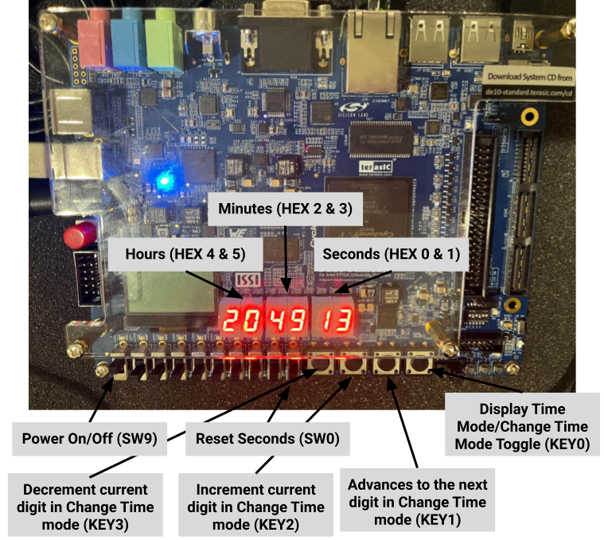
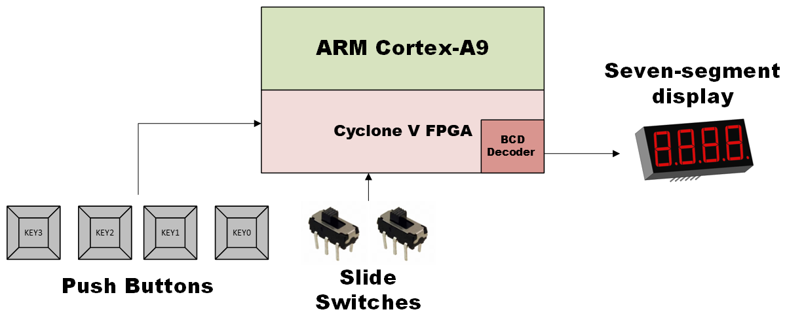

# Clock Application on DE10 Standard

This is my Clock Application project that runs on the DE10-Standard development board and is implemented using C and VHDL. The application uses the ARM HPS and FPGA on the board to simulate a digital clock, displaying time on the board's seven-segment displays.

## Demos

_System Demo #1: Display Time_


_System Demo #2: Change Time_


## Author


<h2>Alejandro Barranco-Leyte</h2>

## Project Description

The application simulates a simple clock using military time format, displayed on six seven-segment displays. Users can view and modify the time, including hours, minutes, and seconds, using the board's switches and buttons. The FPGA manages the seven-segment displays via a BCD decoder.

## Digital Clock Interface: Time Display and Adjustment Controls



### Features

- Displays the time in 24-hour military format.
- Uses buttons on the DE10-Standard board for user input:
  - **KEY0**: Toggle between "Display Time" and "Change Time" mode.
  - **KEY1**: Move on to the next digit in time change mode.
  - **KEY2**: Increment the current digit in time change mode.
  - **KEY3**: Decrement the current digit in time change mode.
- **SW9** turns the clock on and off.
- **SW0** resets the seconds while in time change mode.
- Flashes the current digit being modified for user clarity.
- The clock reads and saves the current time to a text file for persistence between sessions.

## System Design Overview



## Code Structure

- [`app.c`](app.c): Main application logic handling the display and user interaction.
- [`hardware.c`](hardware.c): Interface with the hardware components, including reading inputs and controlling the displays.
- [`hardware.h`](hardware.h) and [`app.h`](app.h): Header files for function declarations and structure definitions.
- [`DE10_Standard_Computer.v`](Quartus/DE10_Standard_Computer.v): FPGA configuration file defining the hardware connections and logic.
- [`bcd_7segment.vhd`](Quartus/bcd_7segment.vhd): VHDL file defining the BCD to seven-segment display decoder.

## Building the Project

The project is compiled using a Makefile optimized for the DE10-Standard development board. Ensure that you have the necessary cross-compilation tools installed.

### Prerequisites

- **ARM Cross-Compilation Tools**: You will need the `arm-linux-gnueabihf-gcc` toolchain. In this project, I used **gcc-linaro-4.8-2015.06-x86_64_arm-linux-gnueabihf**.

## Build Instructions

1. **Clone the Repository:**

   - Clone the repository to your local development environment:
     ```bash
     git clone https://github.com/alejandrobarranco01/ClockApplication.git
     ```
   - Navigate into the project directory:
     ```bash
     cd ClockApplication
     ```

2. **Build the Application:**

   - Run `make` to build the application:
     ```bash
     make
     ```

3. **Executable:**

   - The executable `ClockApplication` will be generated in the project directory.

4. **Run the Application:**
   - Once built, you can run the application with:
     ```bash
     ./ClockApplication
     ```

### Clean Built Files

1. **Clean Up:**
   - To clean up build artifacts and temporary files, run:
     ```bash
     make clean
     ```

## FPGA Configuration

To configure the FPGA for the clock application:

1. **Use the Quartus Programmer Tool:**

   - Open the **Quartus Programmer** tool (you can find it under the **Tools** menu).
   - Connect the DE10-Standard board to your computer via the USB-Blaster or USB cable.
   - In the Quartus Programmer, click **Auto Detect** on the **Select Device** page to automatically detect the connected hardware.
   - Select the **5CSXFC6D6** device.
   - Click on **Add File** and select the compiled output file [`DE10_Standard_Computer_time_limited.sof`](Quartus/DE10_Standard_Computer_time_limited.sof).
   - Click **Start** to upload the configuration to the FPGA.

2. **Verify the Configuration:**
   - After the FPGA configuration is complete, the clock application should now run on the DE10-Standard board, utilizing the FPGA resources for the seven-segment display and BCD decoder.
   - The Quartus Programmer will indicate a **success** message when the configuration is successfully applied.
